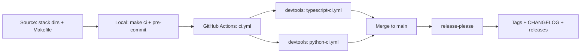

# Architecture

## Purpose

Plot (repo: carto) is a multi-language monorepo with two stacks — TypeScript
frontend and Python backend — behind one GNU Make entrypoint. The
architecture inherits the ostara-labs repo-template: every stack is
optional and auto-detected, with one consistent local and CI experience.

## Layout rationale

Each stack lives in a top-level directory and is auto-detected by a marker
file:

| Stack | Directory | Marker | Package |
|---|---|---|---|
| TypeScript (frontend) | typescript/ | package.json | `@ostara-labs/plot` |
| Python (backend) | python/ | pyproject.toml | `plot-backend` / `plot_backend` |

The Makefile probes markers at runtime: an absent marker prints
`[target] skipped (no <marker>)` and the target succeeds. Adding a stack is
therefore an additive exercise — the stack dir plus its CI, Dependabot, and
release-please entries (see MANIFEST.md) — with zero Makefile edits.

## Flow



Local gates (pre-commit + `make ci`) and CI gates (ci.yml + security.yml)
run the same commands, so a green local run predicts a green CI run. Merges
to main trigger release-please, which derives versions and changelogs from
Conventional Commits.

## Application architecture

```
┌─────────────────────────────┐        ┌─────────────────────────────┐
│  typescript/ (frontend)     │        │  python/ (backend)          │
│  SvelteKit + Skeleton       │  HTTP  │  FastAPI                    │
│  MapLibre GL JS             │ ◄────► │  geopandas / shapely /      │
│  Paraglide (i18n FR/EN)     │  JSON  │  pyproj                     │
└─────────────────────────────┘        └──────────────┬──────────────┘
                                                      │ SQL
                                              ┌───────▼────────┐
                                              │ PostgreSQL     │
                                              │ + PostGIS      │
                                              └────────────────┘
```

External data sources (cadastre, DVF, Géorisques, IGN, ADEME, Hub'Eau…)
are consumed server-side by the backend; see docs/SOURCES.md.

## Where things live

| Concern | Location |
|---|---|
| Local entrypoint | Makefile (canonical targets: help, hooks, format, lint, test, build, ci, clean) |
| Local hooks | .pre-commit-config.yaml |
| CI | ci.yml (thin callers + workflow-lint gate); stack logic in devtools workflows |
| Security scan | .github/workflows/security.yml + .gitleaks.toml |
| Releases | .github/workflows/release.yml + release-please-config.json |
| Governance | AGENTS.md, CONTRIBUTING.md, SECURITY.md, CODE_OF_CONDUCT.md |
| Bootstrap inventory | MANIFEST.md |
| Product spec | SPEC.md + specs/ (wave tree) |
| Decisions | docs/architecture/decisions/ (ADRs) |

## Decisions

Architecture decisions are recorded as ADRs in
docs/architecture/decisions/ — see
docs/architecture/decisions/0001-record-architecture-decisions.md.
